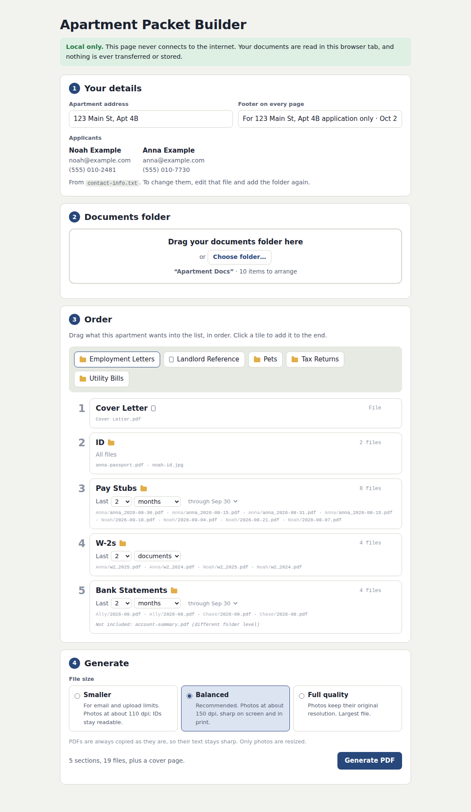

# Apartment Packet Builder

Turn one folder of rental-application documents into a single, tidy PDF for each
apartment: pick what that landlord asks for, put it in order, and get a packet with a
cover page, a linked table of contents and a footer on every page.

**Local only.** It's one HTML file you open in Safari or Chrome on your Mac. It never
connects to the internet, and your documents are never transferred or stored. See
[SECURITY.md](SECURITY.md) for how that's enforced and how to check it yourself.



## How it works

1. **Your details.** Type the apartment's address. The footer fills in from it.
2. **Documents folder.** Drag in the folder that holds all your documents.
3. **Order.** Every top-level folder and file in it appears as a tile. Drag the ones this
   apartment wants into the list, in order. For folders with dated files, choose
   **Last 2 months** or **Last 2 documents**, for example.
4. **Generate.** Choose a file size and click **Generate PDF**. It's saved to your
   Downloads folder.

## Setup (no coding needed)

### 1. Get the app

Download `apartment-packet-builder.html` from the
[Releases page](../../releases) and keep it anywhere, such as your Documents folder.

> No release yet? Ask someone who uses Node.js to run `npm ci && npm run build` and send
> you `dist/index.html`, or follow [For developers](#for-developers).

### 2. Set up your documents folder

Keep it **outside** this project, for example `Documents/Apartment Docs`. Arrange it
however makes sense to you. Here's one way:

```
Apartment Docs/
├── contact-info.txt          ← names and contact details for the cover
├── Cover Letter.pdf          ← a top-level file is its own option
├── ID/
│   ├── noah-license.jpg
│   └── anna-passport.pdf
├── Pay Stubs/
│   ├── Noah/
│   │   ├── 2026-09-18.pdf
│   │   └── 2026-09-04.pdf
│   └── Anna/
│       └── anna_2026-09-30.pdf
├── W-2s/
│   ├── Noah/w2_2025.pdf
│   └── Anna/w2_2025.pdf
└── Bank Statements/
    ├── Chase/2026-09.pdf
    └── Ally/2026-09.pdf
```

The rules:

- **Each top-level folder and top-level file is one option** you can drag into the packet.
  Folder names are used as section titles, so name them the way you want them to read.
- **Put dates in file names** so date ranges work: `2026-09-18` for a day, `2026-09` for a
  month, `2025` for a year. They can go anywhere in the name (`anna_2026-09-30.pdf`).
  US-style dates like `09-10-2026` are ignored because they're ambiguous.
- **Subfolders are fine** (for example one per person). Their names don't matter. They're
  only shown as faint labels.
- **One nesting level per folder.** A folder uses only the files at its deepest level. If
  `Bank Statements/` has `Chase/2026-09.pdf` and also a loose `summary.pdf`, the loose
  one is left out, and the app tells you so.
- **Supported files:** PDF, JPG, PNG and HEIC (iPhone photos; HEIC needs Safari). Hidden
  files like `.DS_Store` are ignored.

### 3. Add your contact info

Create a plain-text file named `contact-info.txt` at the top of the folder. In TextEdit,
choose Format → Make Plain Text before saving.

```
Name: Noah Example
Email: noah@example.com
Phone: (555) 010-2481

Name: Anna Example
Email: anna@example.com
Phone: (555) 010-7730
```

One `Label: value` per line, a blank line between people, and each person starts with
`Name`. Other labels (like `Current address: 88 Elm St`) are printed too. Lines starting
with `#` are ignored. If something's off, the app points to the exact line.

### 4. Open the app

Double-click `apartment-packet-builder.html`. If it opens in something other than a
browser, right-click it and choose Open With → Safari (or Chrome).

Want to try it first? Use the fake sample folder in [`example/Apartment Docs`](example).

## Date ranges

| Choice               | What's included                                                                                                             |
| -------------------- | --------------------------------------------------------------------------------------------------------------------------- |
| **Last 2 months**    | Files dated within the last two _full_ months. On Oct 4 that's Aug 1 – Sep 30. Switch to "through today" for Aug 4 – Oct 4. |
| **Last 2 documents** | The newest two files **in each subfolder**, so "last 2 W-2s" gives two for each person when they're in `Noah/` and `Anna/`. |
| **All files**        | Everything in the folder. Folders without dates always use this.                                                            |

Folders start on a sensible choice: months for pay stubs and statements, documents for
files dated only by year (W-2s, tax returns).

## File size

PDFs are always copied exactly, so their text stays sharp. Only photos are resized,
based on how large they print on a letter page:

| Choice                 | Photos              | Good for                           |
| ---------------------- | ------------------- | ---------------------------------- |
| Smaller                | about 110 dpi       | email and upload limits            |
| **Balanced** (default) | about 150 dpi       | almost everything. IDs stay crisp. |
| Full quality           | original resolution | when every pixel matters           |

If a packet is still big, it's usually a scanned PDF. In Preview, choose File → Export,
then Quartz Filter → Reduce File Size, and use the smaller copy.

## Troubleshooting

- **"Password-protected"**: open the PDF in Preview, choose File → Export as PDF, and use
  the exported copy.
- **"This browser can't open HEIC photos"**: use Safari, or open the photo in Preview and
  export it as JPEG.
- **"Some files couldn't be read"**: they may still be in iCloud. In Finder, click the
  cloud icon to download them.
- **A file isn't showing up**: check it's at the same depth as the other files in its
  folder. The faint "Not included" line under each card says why.

## For developers

Requires Node.js 22 or newer.

```sh
npm ci                # install exact, integrity-checked dependencies
npm run dev           # live-reloading dev server
npm run build         # → dist/index.html, the single self-contained file
npm test              # unit tests (Vitest)
npm run test:e2e      # build, then end-to-end tests in a real browser (Playwright)
npm run check         # everything CI runs: format, lint, types, unit and e2e tests
npm run example       # regenerate the fake example folder
```

The first time you run end-to-end tests locally, install the browser:
`npx playwright install chromium` (add `webkit` and set `E2E_WEBKIT=1` to test Safari's engine).

### Project layout

```
src/
  core/      Pure logic, no browser APIs: dates, folder rules, ranges, contact file, naming
  pdf/       Packet assembly with pdf-lib: cover, contents, links, bookmarks, footers, photos
  worker/    The sealed worker that runs pdf-lib, its seal, and the message protocol
  browser/   Browser glue: reading folders, preparing photos, saving the file
  ui/        The interface: four steps, a tiny element builder and a state store
build/       Vite plugin that inlines everything into one HTML file with a hashed CSP
tests/       Unit tests, end-to-end tests and shared helpers
scripts/     Sample-document generator (used by tests and the example folder)
```

How a packet is built: the folder becomes a `Library` of options (`core/library.ts`). The
arranged `PacketItem`s are resolved into sections (`core/packet.ts`). The page reads the
chosen files and prepares photos, then hands the bytes to a fresh sealed worker
(`browser/packetClient.ts`), which assembles the PDF (`pdf/buildPacket.ts`) and returns it.

### Ground rules for contributions

- Never add network access, analytics or browser storage. The lint rules and tests will
  stop you, on purpose.
- Keep `src/core` free of browser APIs so it stays easy to test.
- Insert text with `h()` from `src/ui/dom.ts`; never build HTML from strings.
- Write messages for people: say what went wrong and how to fix it.
- Run `npm run check` before opening a pull request.

## License

[MIT](LICENSE)
